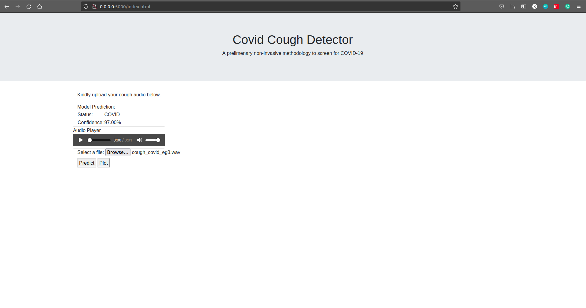
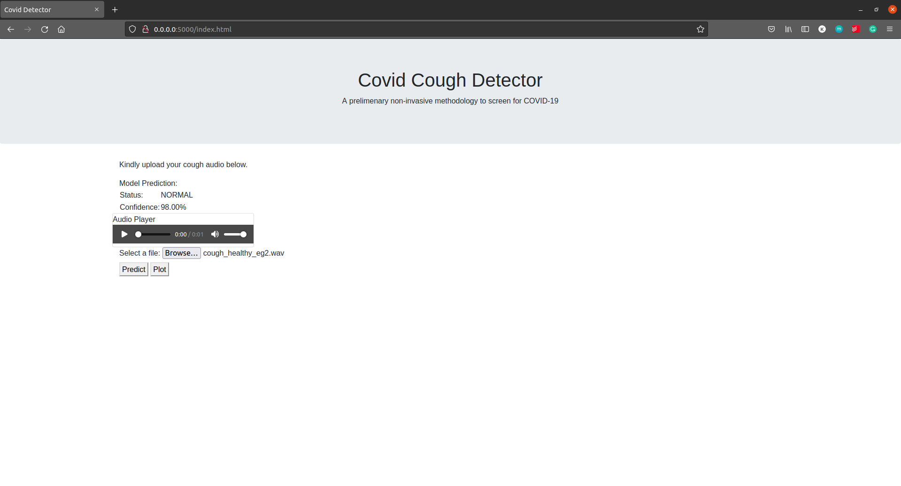
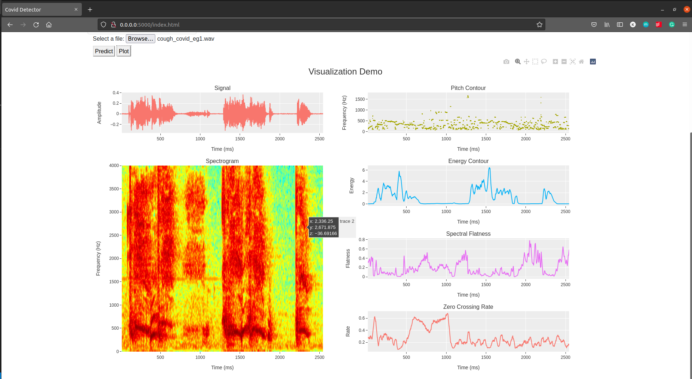

# COVID-19 Detection from Cough

On March 11, 2020, the World Health Organization declared the novel Coronavirus disease (COVID-19) as a [pandemic](https://pubmed.ncbi.nlm.nih.gov/32191675/). Epidemiology experts concur that [mass testing](https://pubmed.ncbi.nlm.nih.gov/32847926/) is essential for isolating infected individuals, contact tracing, and slowing the progression of the virus. While advances in testing have made these tools more widespread in recent months, there remains a need for inexpensive, rapid, and scalable COVID-19 screening technology. One of the most common symptoms of COVID-19 is dry cough, which is present in approximately [67.7%](https://www.scielo.br/j/rb/a/MsJJz6qXfjjpkXg6qVj4Hfj/?lang=en) of the infected patients. Given the high cost and infrastructure required for testing, we look towards building an online non-intrusive initial screening method for detection for Covid-19 in patients only from their cough samples. Towards this aim, introducing RIA (Respiratory Illness Assessment) service.

This project provides a simple webpage for end users to interact with, upload their cough sample, get an estimate if they are likely to have COVID-19 based on the analysis of their cough sample. This tool also provides a visualization endpoint wherein users can access an interactive plot of the 1)time domain representation, 2)spectrogram, 3)pitch countour, 4)energy contour, 5)spectral flatness, and 6)zero crossing rate of the cough signal. This can help them make a more informed study and derive inferences. 

A few screenshots of the tool in action- 







A working demo of the project can be accessed here - [Video explanation](https://youtu.be/pgjenwWmvJ0)

Note - This is a simple test project and in no way a candidate to replace the current testing paradigm. This can help in the initial screening phase if there are only a limited number of covid-19 test kits available, but hasn't been tested on a large enough scale to determine it's efficacy.

How to use:
```
1) Clone the repository
2) Follow the Makefile, run -
    * make environment
    * make run
```
This will open the [webpage](ria/static/index.html) in your local machine at 0.0.0.0 on port 5000 (http://0.0.0.0:5000/index.html).
